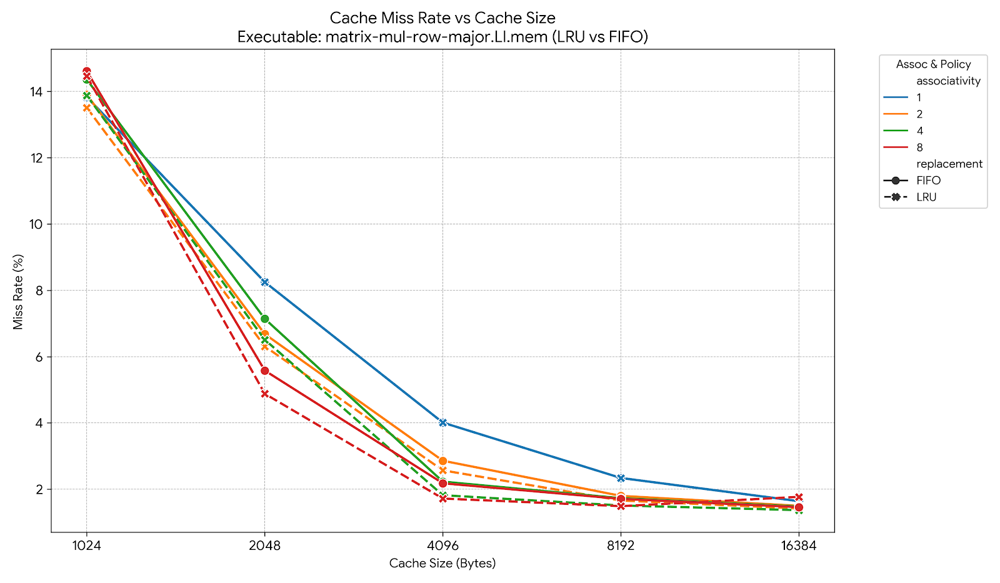
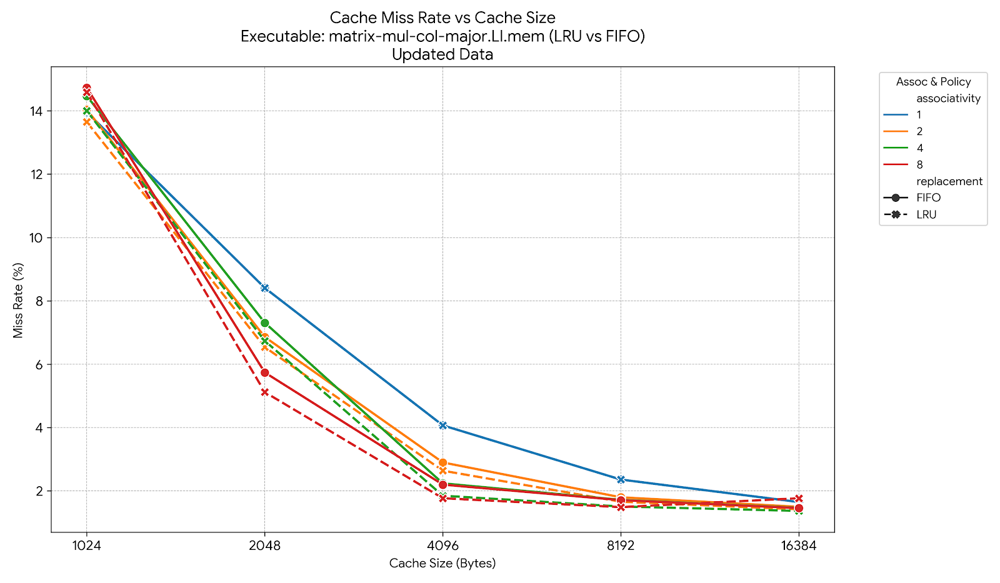
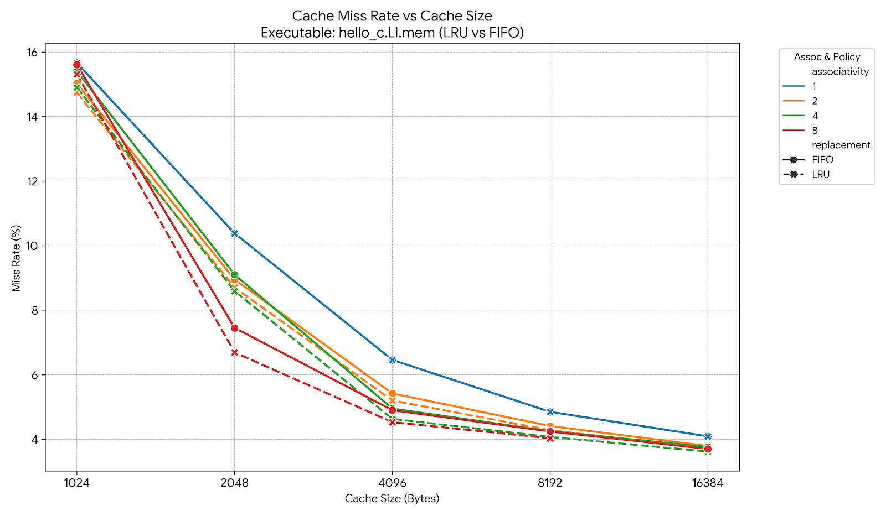
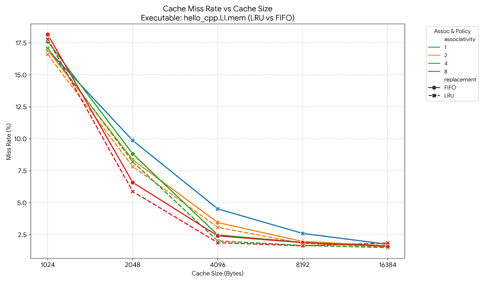

# Lab 6 - Caches Lab Report
**Name:** [Thomas Miko]
**Email:** [tmiko001@ucr.edu]

### Chosen Configurations & Justification
Overall from the tests, it was shown that increasing both the cache size and the associativity leads to lower miss rates. \
This trend was true for all example programs however the speed of increases was different acrross programs.

Addtionally, increasing associativity decreased the miss rates. \
However they showed a diminishing return in miss rate reduction. A 4-way set associative showed the best change in performance before dropping off

Because hardware cost scales linearly with associativity, an 8-way cache requiring double the hardware of a 4-way cache woudn't make much sense for some applications. For example, a cpu on a personal computer would not see as much return on investment for doubling the price of the cache. However on a computer used constantly for consuming calculations (like matrix multiplication) the price of the cache might make sense in the long run.

In my opinion, a 4096-byte 4-way set-associative cache with LRU replacement is a good sweet spot for general purposes.

## Performance Chart

Below is the plot tracking the miss rate across different cache sizes and associativity levels for the matrix-mul-row-major, matrix-mul-col-major, hello_c, hello_cpp unified cache using the LRU and FIFO replacement policy.

## Observations Across Executables

1.  **Spatial Locality:** Because of how matrices are stored in ram, there is a difference in how column and row major performed in the tests Because c stores them in row major, this executable was able to use alrger caches much more effectively. 
2.  **Diminishing Returns on LRU vs FIFO:** Across most executables, LRU slightly outperforms FIFO. However, the differences are very small. In addition, as the cache size gets bigger, the number of misses stops decreasing as fast. As a result the difference between the two grows even smaller.

